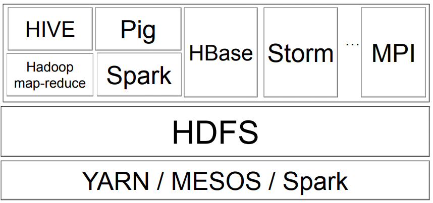

# Hadoop

**Paradoja de Congestión**. Los discos duros cuanta más capacidad, más velocidad.

Las **3 V's**
- Volumen:
  - Petabytes
  - Bajo coste del almacenamiento
  - Crecimiento Exponencial
- Velocidad:
  - Cambio
  - Generación
  - Consumición
  - Tiempo real
  - Streaming
- Variedad
  - Structurado (RDBMS)
  - Desestructurado (Fotos, GPS)
  - Semiestructurado (JSON, XML)
---

1. Repartido Informática -> De Super Computadoras a PC
2. Algoritmos paralelos -> map-reduce
3. Bases de datos NoSQL -> De ACID a BASE

**MapReduce** ejecuta algoritmos de forma paralela.

El sistema debe soportar
fracaso parcial
- Si un componente falla, el sistema
degrada el rendimiento
suavemente
- No hay falla catastrófica de la
sistema completo

---
**Hadoop** es el marco de código abierto
dirigido a resolver computación paralela
de enormes conjuntos de datos

- **HDFS**
- **Map reduce**
- **Yarn**

La **politica** de Hadoop:

- Aplicaciones en **código de alto nivel**
  - No preocuparse por los recursos de bajo nivel, sincronización y manejo de datos
- No compartir nada de arquitectura
  - Manejo de errores, confiabilidad
- Los datos se **distribuyen** entre las máquinas.
  -  Trae el código a los datos
- Los datos se **replican**
  - I/O limitada, no vinculada a la CPU
- Los datos **se dividen en fragmentos** cuando se cargan en el
sistema
  - Tamaño de bloque 64, 128 o 256 MB
  - Determina el primer nivel de paralelismo
- Las tareas de mapa soportan estas porciones de datos.
- Un programa maestro intenta **asignar mapas**
a los datos almacenados en alguna máquina como
mapa
  - Datos locales 
- Si un nodo falla, el maestro **detecta la falla**
  - Se **reasigna** a un nodo diferente en el sistema
  - **Reiniciar** la tarea no requiere comunicación con otros nodos que trabajan en otro porciones de los datos
    - así que no hay efectos en cascada
- Si el nodo vuelve
  - Asigna automáticamente nuevas tareas
- Ejecución **especulativa**
  - La misma tarea puede ser iniciada por diferentes nodos y "elegir" al que termine primero

- Core technologies
  - **HDFS**
  - **Map-Reduce**
- Ingesta de datos
  - **Sqoop** – from databases
  - **Flume** – streaming
- API de alto nivel
  - **Pig**: data flow – via map-reduce  scripts
  - **HIVE**: almacén de datos“a la SQL”
- key-value almacena en HDFS
  - **HBASE**
- flujos de trabajo de orquestación – **Oozie**
- coordinación distribuida – **Zookeeper**