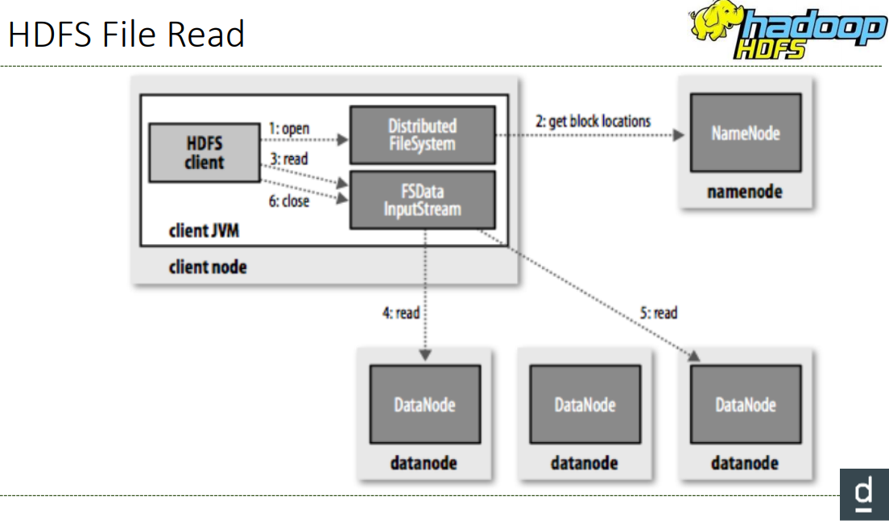
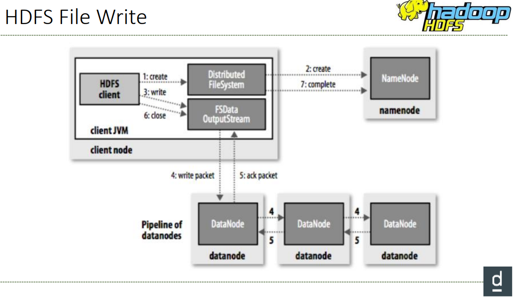

# HDFS

- NameNode -> **Master**
- DataNode -> **Slave**

Preferible pocos archivos grandes que muchos pequeños. El criterio es el tamaño del bloque ( > 100 MB)

---
## Componentes

- **Cliente** -> solicita operaciones del fichero, input, output.
- **NameNode** -> Logs de todas las transacciones. Almacena el bloque donde está localizado cada fichero.
- **DataNodes** -> almacenan los bloques.
- **NameNode secundario** -> punto de control para el namenode.

Se pueden tratar los datos de HDFS via la API, de java.
Los archivos se crean en un sistema de ficheros local y se mueven dentro de HDFS.
El acceso al cliente de HDFS se hace via linea de comandos con **hadoop fs**.

- `hdfs dfs -put file /user/hdfs/file`

- `hdfs dfs -get file /user/hdfs/file`

- `hdfs dfs -cat /user/hdfs/file`

- `hdfs dfs -mkdir /user/hdfs/`

- `hdfs dfs -rm -r /user/hdfs/`

---
## NameNode

- El daemon NameNode debe estar ejecutándose en todo momento
- El clúster se vuelve inaccesible
- Mantiene en la memoria todas las ubicaciones de bloque para un archivo dado
- El NameNode mantiene todos los datos en la memoria rápidamente
acceso
- Guarda instantáneas de la memoria en un archivo para recuperación de fallos

---
## Secundary NameNode

- No es una copia de seguridad del NameNode
- Ayuda al NameNode en algunas tareas
  - Actualice los cambios en el mapa de bloque de archivos entre
instantáneas

---
## Alta disponibilidad

- Dos NameNode
  - Un nodo de nombre activo
  - Un nombre de nodo en espera
- Si el **Activo** falla, el nodo en Standby se hace cargo.
- El modo de espera actúa como un nodo de nombre secundario
  - No es necesario un **NameNode** secundario además
- El administrador decidirá instalarlo
  - Necesita **Zookeeper** para conmutación por error automática
  - Otras formas, la intervención humana para cambiar.

---
**Problema de archivo pequeño**
- Si un archivo es más pequeño que el tamaño de bloque
  - En el disco ocupará el tamaño del archivo, no un bloque completo
  - Pero el NameNode lo rastreará
    - ya que tenía el tamaño de bloque (por ejemplo, 128 MB)
  - Seguir la pista consume memoria en el NameNode (aprox. 200 Bytes)
- Si tiene demasiados archivos, puede agotar la memoria de NameNode

