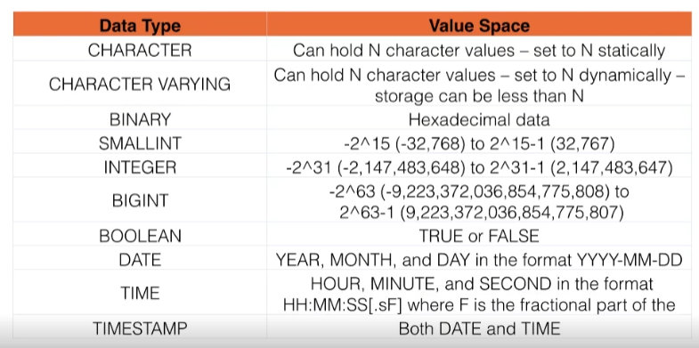

# SQL

- [Sistemas SQL](#Sistemas_SQL)
- [Tipos de comandos](#Tipos_de_comandos)
- [DML](#DML)
- [DQL](#DQL)
- [DDL](#DDL)
- [JOINs](#JOINs)
- [DCL](#DCL)
- [Vista](#Vista)
- [Subqueries](#Subqueries)

---

## Sistemas SQL

- DB2
- Firebird
- HSQL
- Informix
- InterBase
- MariaDB
- Microsoft SQL Server
- MySQL
- Oracle
- PostgreSQL
- PervasiveSQL
- SQLite
- Sybase ASE

En particular, la sintaxis de fecha y tiempo, la concatenación de cadenas, nulas, y la comparación de textos en cuanto al tratamiento de mayúsculas y minúsculas varían de un proveedor a otro. Una excepción particular es PostgreSQL, que se esfuerza por lograr el cumplimiento del estándar.

- Oracle tiene el tipo `DATE` se comporta como `DATETIME`, y carece de un tipo `TIME`

Diferencias entre Oracle y SQL Server

- El sistema de control de transacciones en ambas bases de datos es diferente. MS SQL Server ejecutará cada tarea individualmente de forma predeterminada y será más difícil deshacer los cambios si se encuentran errores en el camino. Mientras que en Oracle los cambios se realizan solo en la memoria y no se confirma nada hasta que se da una declaración explícita «COMMIT» con algunas excepciones.
- MS SQL Server organiza todos los objetos como tablas, vistas y procedimientos por nombres de base de datos. En Oracle Database, todos los objetos de la base de datos están agrupados por esquemas y usuarios.
- La interfaz de Oracle Database es GUI y SQL y de MS SQL Server es solo SQL.
- MS SQL Server admite el lenguaje D que no es compatible con Oracle Database.
- Oracle Database es un software propietario. MS SQL Server es un software de código abierto.
- Oracle Database está disponible para Windows, Linux, Solaris, HP-UX, OS X, z / OS y AIX. MS SQL Server está disponible para Windows, Linux, OS X, FreeBSD y Solaris.

Hay varias razones para esta falta de portabilidad entre sistemas de bases de datos:

- La complejidad y el tamaño del estándar SQL conlleva a que la mayoría de las implementaciones de SQL no sean compatibles con la norma completa.
- La norma no especifica el comportamiento de la base de datos en varias áreas importantes (por ejemplo, índices, almacenamiento de archivos, etc.), dejando a las implementaciones decidir cómo comportarse.
- El estándar SQL especifica con precisión la sintaxis que un sistema de base de datos conforme debe implementar. Sin embargo, no está tan bien definida la especificación en el estándar de la semántica de las construcciones del lenguaje, lo que lleva a ambigüedad.
- Muchos proveedores de bases de datos tienen grandes bases de clientes existentes, por lo que introducir cambios para adaptarse el estándar podría producir incompatibilidades en las instalaciones de los usuarios y el proveedor puede no estar dispuesto a abandonar la compatibilidad con versiones anteriores.
- Hay poco incentivo comercial para que un proveedor facilite a los usuarios el cambiar de proveedor de bases de datos.
- Los usuarios que evalúan el software de base de datos tienden a valorar más otros factores tales como el rendimiento más alto en sus prioridades sobre las conformidad al estándar.
- El estándar ODBC (Open Database Connectivity) permite acceder a la información desde cualquier aplicación independientemente del sistema de gestión de base de datos (DBMS) en el que esté almacenada la información, desacoplando así la aplicación de la base de datos.

---

## Tipos de comandos

- **DML** : Lenguaje de manipulación de datos (contiene comandos para operaciones de inserción, actualización y eliminación).
- **DQL** : Lenguaje de consulta de datos.
- **DDL** : Lenguaje de definición de datos (contiene comandos para crear y modificar tareas).
- **DCL** : Lenguaje de control de datos (contiene comandos relacionados con el control de acceso).

---

## DML

 “CRUD” (create, read, update y delete/ sus equivalentes son INSERT, SELECT, UPDATE y DELETE).

### INSERT

La necesidad de especificar las columnas o hacerlo en orden respectivo.

```sql
INSERT INTO person (person_id,person_first_name,person_last_name,person_contacted_number,person_date_last_contacted,person_date_added)
VALUES (5,'Foo','Bar',0,'2017-05-14 11:43:42','2017-05-14 11:43:42');
```

**BULK INSERT**

```sql
INSERT INTO person
(person_id,person_first_name,person_last_name,person_contacted_number,person_date_last_contacted,person_date_added)
VALUES
(6,'Foo6','Bar',0,'2017-05-14 11:43:42','2017-05-14 11:43:42'),
(7,'Foo7','Bar',0,'2017-05-14 11:43:42','2017-05-14 11:43:42'),
(42,'Foo8','Bar',0,'2017-05-14 11:43:42','2017-05-14 11:43:42');
```

**INSERT SELECT**:  puedes usar los valores de selección que te proporciona el SELECT de otra tabla previa, y utilizarlos directamente como la lista de columnas. Utilizas una tabla como base de la nueva para la actualización de los datos.

```sql
INSERT INTO 
person p
SELECT 
* FROM old_person op
Where op.person_id > 300;
```

### **UPDATE**: Modifica columna(s) en una sola tabla. El comando WHERE va a dictaminar qué filas van a verse afectadas, y el comando SET va a determinar las columnas y los valores que vamos a actualizar

```sql
UPDATE person p
SET
p.person_first_name = 'Bob',
p.person_last_name = 'Foo'
WHERE
p.person_id = 0;
```

### **DELETE**: cuidado! fijarse en utilizar WHERE en estos comandos

```sql
DELETE DELETE FROM person 
WHERE person_id > 4;
```

---

## DQL

- AND

```sql
SELECT p.person_last_name 
FROM 
person p
WHERE p.person_first_name = 'Jon'
AND
p.person_contacted_number > 5;
```

- OR

```sql
SELECT p.person_last_name 
FROM 
person p
WHERE p.person_first_name = 'Jon'
OR
p.person_contacted_number > 0;
```

- BETWEEN

```sql
SELECT p.person_last_name 
FROM 
person p
WHERE p.person_contacted_number 
BETWEEN 1 AND 20; 

```

- LIKE - %

```sql
SELECT p.person_last_name 
FROM 
person p
WHERE p.person_first_name 
LIKE 'J%';
```

- IN

```sql
SELECT  p.person_last_name
FROM person p
WHERE p.person_first_name
IN ('Jon','Fritz');
```

- IS

```sql
SELECT e.email_address_person_id, e.email_address
FROM
email_address e
WHERE
e.email_address_person_id IS NULL
```

- IS NOT

```sql
SELECT e.email_address_person_id, e.email_address
FROM
email_address e
WHERE
e.email_address_person_id IS NOT NULL
```

---

- DISTINCT: se utiliza para acotar, directamente dentro del comando select. Con ello podemos averiguar cuantos elementos distintos tenemos, utilizando por ejemplo "COUNT".

```sql
SELECT DISTINCT Country FROM Customers;

SELECT COUNT(DISTINCT Country) FROM Customers;
```

---

- ORDER

```sql
SELECT p.person_first_name,p.person_last_name
FROM person p
ORDER BY p.person_last_name;
```

- GROUP

```sql
SELECT  column_name(s)
FROM table_name
WHERE condition
GROUP BY column_name(s);
```

---
SET FUNCTIONS:

- COUNT

```sql
SELECT COUNT(p.person_first_name)
FROM person p
WHERE p.person_last_name = 'Ahern';
```

- MAX

```sql
SELECT MAX(p.person_contacted_number)
FROM person p;
```

- MIN

```sql
SELECT MIN(p.person_contacted_number)
FROM person p;
```

- AVERAGE

```sql
SELECT AVG(p.person_contacted_number)
FROM person p;
```

- SUM

```sql
SELECT SUM(p.person_contacted_number)
FROM person p;
```

- HAVING

```sql
SELECT COUNT(CustomerID), Country
FROM Customers
GROUP BY Country
HAVING COUNT(CustomerID) > 5;
```

---

## JOINs

Si no se especifica el tipo de JOIN se realiza INNER JOIN.


- CROSS JOIN:
Consulta ineficiente, evitar. No utilizar. Cruza cada dato de las columnas utilizadas de la primera tabla con cada dato de las columnas utilizadas de la segunda tabla.

```sql
SELECT
```

- INNER JOIN: La más común. Hay que tener al menos un elemento que relacione las dos tablas.

Ejemplo:
¿Cuáles son las direcciones de email de mis contactos?

Relacionamos las tablas a través del elemento común, en este caso el identificador del contacto. p. person_id es primary key, mientras que e. email_address_person_id es la foreign key

Las INNER JOINs no tratan con valores “null” (ignoran , y las OUTER JOINs sí.

```sql
SELECT p. first_name, p.last_name, e.email_address
FROM person p
INNER JOIN email_address e
ON p. person_id= e. email_address_person_id;
```

- OUTER JOIN: Los OUTER JOINs darán valores “null” cuando no haya coincidencia en la presencia de datos de las tablas relacionadas, y lo reflejarán en el resultado. Nos sirve para tener en cuenta esos valores “null”.

```sql
SELECT p. first_name, p.last_name, e.email_address
FROM person p
OUTER JOIN email_address e
ON p. person_id= e. email_address_person_id;
```

- LEFT OUTER JOIN: Unión que puede dar valores “null”
todas las filas procedentes de la tabla “izquierda” se verán reflejadas en el resultado.
Las filas de la “derecha”, la de la foreign key, darán el resultado correspondiente, incluyendo los valores “null”
El esquema de construcción de la query es el mismo.

```sql
SELECT p. first_name, p.last_name, e.email_address
FROM person p
LEFT OUTER JOIN email_address e
ON p. person_id= e. email_address_person_id;
```

- RIGHT OUTER JOIN: Exactamente lo contrario al apartado anterior, se reflejan todas las filas de la tabla derecha, y los correspondientes de la tabla izquierda, incluyendo los valores “null”.

```sql
SELECT p. first_name, p.last_name, e.email_address
FROM person p
RIGHT OUTER JOIN email_address e
ON p. person_id= e. email_address_person_id;
```

- FULL OUTER JOIN: Combinación de las dos últimas uniones, obtenemos un resultado más completo que comprendería los matches de presencia de información de las tablas izquierda y derecha, además de los null presentes en cualquiera de las tablas. Todo esto matizando que siempre hablamos de las columnas especificadas en SELECT, no de las dos tablas en su totalidad.

MySQL no da soporte a este tipo de opción, a pesar de formar parte del estándar de SQL.
Sin embargo se puede hacer algo similar, que en general no se recomienda demasiado, pero es interesante saberlo.
Consiste en utilizar la keyword UNION junto con DISTINCT (para evitar la duplicación de filas) entre el código de la query LEFT OUTER JOIN y la query RIGHT OUTER JOIN. Se considera más avanzado pero aquí está.

```sql
SELECT p. first_name, p.last_name, e.email_address
FROM person p
FULL OUTER JOIN email_address e
ON p. person_id= e. email_address_person_id;
```

- SELF JOIN: El concepto detrás de esta JOIN es un poco particular, porque consiste en unir una tabla consigo misma. Suena raro pero puede resultar útil. No hay una KEYWORD asociada a esta JOIN, es algo conceptual que puede utilizarse en cualquiera de las JOINs anteriores, poniendo a la izquierda y a la derecha la misma tabla. Es útil para tablas que contienen información jerarquizada, como empleados y sus superiores, por ejemplo.

```sql
SELECT A.CustomerName AS CustomerName1, B.CustomerName AS CustomerName2, A.City
FROM Customers A, Customers B
WHERE A.CustomerID <> B.CustomerID
AND A.City = B.City
ORDER BY A.City;
```

- MERGE:
La instrucción MERGE básicamente une datos de un resultado de origen establecido en una tabla destino. Se envían los datos al MERGE, el los compara (por la llave primaria), si existe los actualiza y si no existe los ingresa, también podría ser que si no cumple con los requisitos los pueda borrar,  insert, update y delete en una sola instrucción.
MERGE también permite comparar dos tablas, una fuente y otra destino en ingresar o modificar los datos de la tabla en base a los datos de otra tabla, eso lo veremos en otro ejemplo que publicaremos en este sitio.

```sql
MERGE TargetProducts AS Target
USING SourceProducts AS Source
ON Source.ProductID = Target.ProductID
WHEN NOT MATCHED BY Target THEN
    INSERT (ProductID,ProductName, Price) 
    VALUES (Source.ProductID,Source.ProductName, Source.Price);
```

---

## DDL

- CREATE TABLE

```sql
CREATE TABLE Persons (
    PersonID int,
    LastName varchar(255),
    FirstName varchar(255),
    Address varchar(255),
    City varchar(255)
);
```

- ALTER TABLE

```sql
ALTER TABLE Customers
ADD Email varchar(255);
```

- DROP TABLE

```sql
DROP TABLE Shippers;
```

### Data Types



### CONSTRAINTS

Las restricciones de SQL se utilizan para especificar reglas para los datos de una tabla.

- PRIMARY KEY:
Las KEYS son una parte muy importante del diseño de una base de datos, porque son esenciales para el sistema relacional. La primera es la PRIMARY KEY, que tiene una serie de condiciones:

  - Debe ser único por fila.
  - No puede ser nulo.
  - Pueden ser varias columnas

```sql
ALTER TABLE Persons
ADD PRIMARY KEY (ID);
/* AUTO_INCREMENT */
/* ALTER TABLE Persons AUTO_INCREMENT=100; */
```

- UNIQUE:
Asegura que todos los valores en una columna sean diferentes.

```sql
ALTER TABLE Persons
ADD UNIQUE (ID);
```

- FOREIGN KEY: La FOREIGN KEY restricción se utiliza para evitar acciones que destruirían enlaces entre tablas.
Una FOREIGN KEY un campo (o colección de campos) en una tabla, que se refiere a PRIMARY KEY en otra tabla.
La tabla con la clave externa se denomina tabla secundaria, y la tabla con la clave principal se denomina tabla principal o de referencia.

```sql
ALTER TABLE Orders
ADD FOREIGN KEY (PersonID) REFERENCES Persons(PersonID);
```

- NOT NULL

El significado de NULL es que no hay valor real, que está “vacío”, lo cual no es lo mismo que un 0.
Si una columna es obligatoria o REQUIRED no puede tener valores NULL, en caso contrario sí que puede haber valores NULL.
Definir qué columnas van a ser REQUIRED y cuáles no es una cuestión de lógica.

```sql
ALTER TABLE Persons
MODIFY Age int NOT NULL;
```

- CHECK

```sql
ALTER TABLE Persons
ADD CHECK (Age>=18);
```

- DEFAULT

```sql
ALTER TABLE Persons
ALTER City SET DEFAULT 'Sandnes';
```

- Indices: Los índices se utilizan para recuperar datos de la base de datos más rápidamente que de otra manera. Los usuarios no pueden ver los índices, solo se utilizan para acelerar las búsquedas/consultas.

```sql
CREATE INDEX idx_lastname
ON Persons (LastName);
```

### Secuencia

Una secuencia es un objeto enlazado a un esquema definido por el usuario que genera una secuencia de valores numéricos según la especificación con la que se creó la secuencia.

CYCLE para permitir que la secuencia genere valor después de alcanzar el límite, el valor mínimo para una secuencia descendente y el valor máximo para una secuencia ascendente.
Cuando una secuencia ascendente alcanza su valor máximo, genera el valor mínimo.
Por otro lado, cuando una secuencia descendente alcanza su valor mínimo, genera el valor máximo.

CACHE Especifique la cantidad de valores de secuencia que Oracle preasignará y mantendrá en la memoria para un acceso más rápido.

```sql
CREATE SEQUENCE id_seq
    INCREMENT BY 10
    START WITH 10
    MINVALUE 10
    MAXVALUE 100
    CYCLE
    CACHE 2;
```

---

## DCL

### Schema

En SQL Server los esquemas representan un conjunto lógico dentro de una base de datos. Permiten organizar mejor de manera lógica las tablas, vistas, procedimientos y funciones. Por defecto, durante la creación de un objeto, éste se registra en el esquema del usuario actual.

### Sinónimo

Un sinónimo es un objeto de base de datos que sirve para los siguientes objetivos:
Proporciona un nombre alternativo para otro objeto de base de datos, denominado objeto base, que puede existir en un servidor local o remoto.
Proporciona una capa de abstracción que protege una aplicación cliente de cambios realizados en el nombre o la ubicación del objeto base.

### Grants

El comando GRANT permite asignar accesos por usuario sobre una o más tablas. Los derechos más utilizados son: SELECT: autoriza la selección de datos. UPDATE: autoriza la modificación de datos.

---

## Vista

En una base de datos, una vista es el conjunto de resultados de una consulta almacenada en los datos. Es una consulta que se presenta como una tabla (virtual) a partir de un conjunto de tablas en una base de datos relacional.

Las vistas tienen la misma estructura que una tabla: filas y columnas. La única diferencia es que sólo se almacena de ellas la definición, no los datos. Los datos que se recuperan mediante una consulta a una vista se presentarán igual que los de una tabla. De hecho, si no se sabe que se está trabajando con una vista, nada hace suponer que es así. Al igual que sucede con una tabla, se pueden insertar, actualizar, borrar y seleccionar datos en una vista. Aunque siempre es posible seleccionar datos de una vista, en algunas condiciones existen restricciones para realizar el resto de las operaciones sobre vistas.
Una vista se especifica a través de una expresión de consulta (una sentencia SELECT) que la calcula y que puede realizarse sobre una o más tablas. Sobre un conjunto de tablas relacionales se puede trabajar con un número cualquiera de vistas.

```sql
CREATE VIEW [Brazil Customers] AS
SELECT CustomerName, ContactName
FROM Customers
WHERE Country = 'Brazil';
```

---

## Subqueries

Es una consulta en una consulta. La subconsulta SQL generalmente se agrega en la cláusula WHERE de la declaración SQL. La mayoría de las veces, se usa una subconsulta cuando sabe cómo buscar un valor usando una declaración SELECT, pero no sabe el valor exacto en la base de datos.

```sql
SELECT id, first_name 
FROM student_details 
WHERE first_name IN (SELECT first_name
FROM student_details 
WHERE subject= 'Science'); 
```

---

## Procedimiento Almacenado

Un procedimiento almacenado (stored procedure en inglés) es un programa (o procedimiento) almacenado físicamente en una base de datos. Su implementación varía de un gestor de bases de datos a otro. La ventaja de un procedimiento almacenado es que al ser ejecutado, en respuesta a una petición de usuario, es ejecutado directamente en el motor de bases de datos, el cual usualmente corre en un servidor separado. Como tal, posee acceso directo a los datos que necesita manipular y sólo necesita enviar sus resultados de regreso al usuario, deshaciéndose de la sobrecarga resultante de comunicar grandes cantidades de datos salientes y entrantes.
Los procedimientos pueden ser ventajosos: cuando una base de datos es manipulada desde muchos programas externos. Al incluir la lógica de la aplicación en la base de datos utilizando procedimientos almacenados, la necesidad de embeber la misma lógica en todos los programas que acceden a los datos es reducida. Esto puede simplificar la creación y, particularmente, el mantenimiento de los programas involucrados.

```sql
CREATE procedure CalcIncome ( OUT ending_value INT )

BEGIN

   DECLARE income INT;

   SET income = 50;

   label1: WHILE income <= 3000 DO
     SET income = income * 2;
   END WHILE label1;

   SET ending_value = income;

END;
```

---

## Triggers

Un activador de base de datos es un programa almacenado que se activa o ejecuta automáticamente cuando se producen algunos eventos. Un disparador puede ejecutarse en respuesta a cualquiera de los siguientes eventos:

1. Una declaración de manipulación de base de datos (DML) como DELETE, INSERT o UPDATE.
2. Una declaración de definición de base de datos (DDL) como CREATE, ALTER o DROP.
3. Una operación de base de datos como SERVERERROR, LOGON, LOGOFF, STARTUP o SHUTDOWN.

Nota: Se puede definir un disparador en la tabla, vista, esquema o base de datos con la que está asociado el evento.

```sql
CREATE TRIGGER t_country_insert ON country INSTEAD OF INSERT
AS BEGIN
    DECLARE @country_name CHAR(128);
    DECLARE @country_name_eng CHAR(128);
    DECLARE @country_code  CHAR(8);
    SELECT @country_name = country_name, @country_name_eng = country_name_eng, @country_code = country_code FROM INSERTED;
    IF @country_name IS NULL SET @country_name = @country_name_eng;
    IF @country_name_eng IS NULL SET @country_name_eng = @country_name;
    INSERT INTO country (country_name, country_name_eng, country_code) VALUES (@country_name, @country_name_eng, @country_code);
END;
```

---

## Normalización

La normalización de bases de datos es un proceso que consiste en designar y aplicar una serie de reglas a las relaciones obtenidas tras el paso del modelo entidad-relación al modelo relacional con objeto de minimizar la redundancia de datos, facilitando su gestión posterior.

---

### Primera Forma Normal (1FN)

Una tabla está en primera forma si:

- Todos los atributos son atómicos. Un atributo es atómico si los elementos del dominio son simples e indivisibles.
- No debe existir variación en el número de columnas.
Los campos no clave deben identificarse por la clave (dependencia funcional).
- Debe existir una independencia del orden tanto de las filas como de las columnas; es decir, si los datos cambian de orden no deben cambiar sus significados.

Esta forma normal elimina los valores repetidos dentro de una base de datos.

---

### Segunda Forma Normal (2FN)

Dependencia funcional. Una relación está en 2FN si está en 1FN y si los atributos que no forman parte de ninguna clave dependen de forma completa de la clave principal. Es decir, que no existen dependencias parciales. Todos los atributos que no son clave principal deben depender únicamente de la clave principal.

Por ejemplo {DNI, ID_PROYECTO} => (con el DNI de un empleado y el ID de un proyecto sabemos cuántas horas de trabajo por semana trabaja un empleado en dicho proyecto) es completamente funcional dado que ni DNI =>  HORAS_TRABAJO ni ID_PROYECTO =>  HORAS_TRABAJO mantienen la dependencia. Sin embargo {DNI, ID_PROYECTO} =>  NOMBRE_EMPLEADO es parcialmente dependiente dado que DNI => NOMBRE_EMPLEADO mantiene la dependencia

---

### Tercera Forma Normal (3FN)

La tabla se encuentra en 3FN si es 2FN y si no existe ninguna dependencia funcional transitiva en los atributos que no son clave.

---

### Forma nomal de Boyce-Codd (FNBC)

La tabla se encuentra en FNBC si cada determinante, atributo que determina completamente a otro, es clave candidata. Deberá registrarse de forma anillada ante la presencia de un intervalo seguido de una formalización perpetua, es decir las variantes creadas, en una tabla no se llegaran a mostrar, si las ya planificadas, dejan de existir.

---

### Reglas

- Regla 1: La regla de la información
Toda la información en un RDBMS está explícitamente representada de una sola manera por valores en una tabla.

Cualquier cosa que no exista en una tabla no existe del todo. Toda la información, incluyendo nombres de tablas, nombres de vistas, nombres de columnas, y los datos de las columnas deben estar almacenados en tablas dentro de las bases de datos. Las tablas que contienen tal información constituyen el Diccionario de datos. Esto significa que todo tiene que estar almacenado en las tablas.

Toda la información en una base de datos relacional se representa explícitamente en el nivel lógico exactamente de una manera: con valores en tablas. Por tanto los metadatos (diccionario, catálogo) se representan exactamente igual que los datos de usuario. Y puede usarse el mismo lenguaje (ej. SQL) para acceder a los datos y a los metadatos (regla 4).

- Regla 2: La regla del acceso garantizado
Cada ítem de datos debe ser lógicamente accesible al ejecutar una búsqueda que combine el nombre de la tabla, su clave primaria y el nombre de la columna

- Regla 3: Tratamiento sistemático de los valores nulos
La información inaplicable o faltante puede ser representada a través de valores nulos

Un sistema gestor de bases de datos relacionales debe ser capaz de soportar el uso de valores nulos en el lugar de columnas cuyos valores sean desconocidos.

Se reconoce la necesidad de la existencia del valor nulo, el cual podría servir para representar, o bien una información desconocida (ejemplo, no se sabe la dirección de un empleado), o bien una información que no procede (a un empleado soltero no se le puede asignar un nombre de esposa). Así mismo, consideremos el caso de un alumno que obtiene 0 puntos en una prueba y el de un alumno que no presentó la prueba.
Hay problemas para soportar los valores nulos en las operaciones relacionales, especialmente en las operaciones lógicas, para lo cual se considera una lógica trivaluada, con tres (no dos) valores de verdad: verdadero, falso y null. Se crean tablas de verdad para las operaciones lógicas:

```
null AND null = null

Verdadero AND null = null

Falso AND null = Falso

Verdadero OR null = Verdadero, etc.
```

- Regla 4: La regla de la descripción de la base de datos
La descripción de la base de datos es almacenada de la misma manera que los datos ordinarios, esto es, en tablas y columnas, y debe ser accesible a los usuarios autorizados.

La información de tablas, vistas, permisos de acceso de usuarios autorizados, etc, debe ser almacenada exactamente de la misma manera: En tablas. Estas tablas deben ser accesibles igual que todas las tablas, a través de sentencias de SQL (o similar).

- Regla 5: La regla del sub-lenguaje integral
Debe haber al menos un lenguaje que sea integral para soportar la definición de datos, manipulación de datos, definición de vistas, restricciones de integridad, y control de autorizaciones y transacciones.

Esto significa que debe haber por lo menos un lenguaje con una sintaxis bien definida que pueda ser usado para administrar completamente la base de datos..

- Regla 6: La regla de la actualización de vistas
Todas las vistas que son teóricamente actualizables, deben ser actualizables por el sistema mismo.

La mayoría de las RDBMS permiten actualizar vistas simples, pero deshabilitan los intentos de actualizar vistas complejas.

- Regla 7: La regla de insertar y actualizar
La capacidad de manejar una base de datos con operandos simples se aplica no sólo para la recuperación o consulta de datos, sino también para la inserción, actualización y borrado de datos'.

Esto significa que las cláusulas para leer, escribir, eliminar y agregar registros (SELECT, UPDATE, DELETE e INSERT en SQL) deben estar disponibles y operables, independientemente del tipo de relaciones y restricciones que haya entre las tablas o no.

- Regla 8: La regla de independencia física
El acceso de usuarios a la base de datos a través de terminales o programas de aplicación, debe permanecer consistente lógicamente cuando quiera que haya cambios en los datos almacenados, o sean cambiados los métodos de acceso a los datos.

El comportamiento de los programas de aplicación y de la actividad de usuarios vía terminales debería ser predecible basados en la definición lógica de la base de datos, y éste comportamiento debería permanecer inalterado, independientemente de los cambios en la definición física de esta.

- Regla 9: La regla de independencia lógica
Los programas de aplicación y las actividades de acceso por terminal deben permanecer lógicamente inalteradas cuando quiera que se hagan cambios (según los permisos asignados) en las tablas de la base de datos.

La independencia lógica de los datos especifica que los programas de aplicación y las actividades de terminal deben ser independientes de la estructura lógica, por lo tanto los cambios en la estructura lógica no deben alterar o modificar estos programas de aplicación.

- Regla 10: La regla de la independencia de la integridad
Todas las restricciones de integridad deben ser definibles en los datos, y almacenables en el catálogo, no en el programa de aplicación.

Las reglas de integridad
Ningún componente de una clave primaria puede tener valores en blanco o nulos (ésta es la norma básica de integridad).
Para cada valor de clave foránea deberá existir un valor de clave primaria concordante. La combinación de estas reglas aseguran que haya integridad referencial.

- Regla 11: La regla de la distribución
El sistema debe poseer un lenguaje de datos que pueda soportar que la base de datos esté distribuida físicamente en distintos lugares sin que esto afecte o altere a los programas de aplicación.

El soporte para bases de datos distribuidas significa que una colección arbitraria de relaciones, bases de datos corriendo en una mezcla de distintas máquinas y distintos sistemas operativos y que esté conectada por una variedad de redes, pueda funcionar como si estuviera disponible como en una única base de datos en una sola máquina.

- Regla 12: Regla de la no-subversión
Si el sistema tiene lenguajes de bajo nivel, estos lenguajes de ninguna manera pueden ser usados para violar la integridad de las reglas y restricciones expresadas en un lenguaje de alto nivel (como SQL).

Algunos productos solamente construyen una interfaz relacional para sus bases de datos No relacionales, lo que hace posible la subversión (violación) de las restricciones de integridad. Esto no debe ser permitido.
